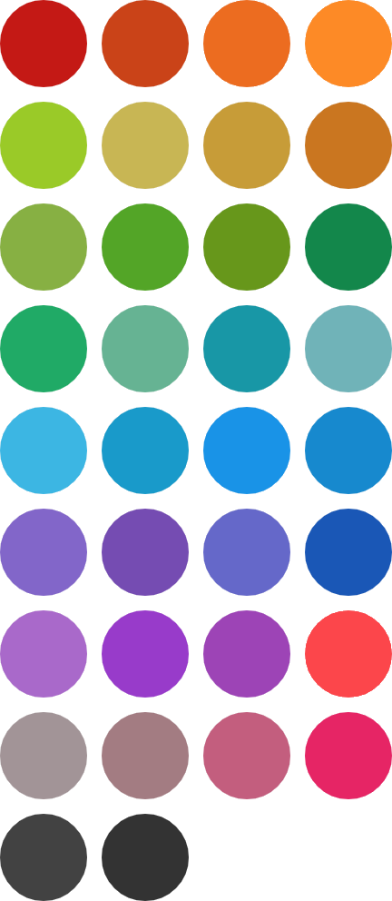

# 系统生成头像

## 十六进制编码
`#C41915`
`#CA4318`
`#EC6C21`
`#FD8A26`
`#9ACA27`
`#C8B655`
`#C79D38`
`#CA7620`
`#87B043`
`#53A527`
`#67971C`
`#13874B`
`#21AA66`
`#66B393`
`#1797A6`
`#6FB3B8`
`#3CB6E3`
`#199ACA`
`#1993E7`
`#1789CE`
`#8266C9`
`#754CB2`
`#6568C9`
`#1A57B6`
`#A969CA`
`#983BCA`
`#9D44B6`
`#FC464B`
`#A29497`
`#A47B82`
`#C35E7E`
`#E62565`
`#424242`
`#333333`

## 规则
未上传头像的兼客取姓名字符串中一个文字加上纯色背景作为头像。颜色随机分配，一旦分配完成则固定使用，不再变更。

此处理方法通用于「岗位详情」及「消息铃铛」等页面。兼客首页抢单卡片中，对已报名兼客头像作特殊处理。为减少视觉干扰，不采用纯色背景，统一以颜色较浅的灰色代替。

