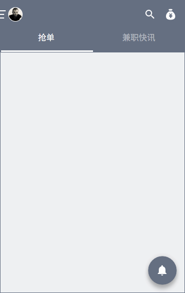

# 兼客首页
## 概览

兼客端首页分为「抢单」「兼职快讯」两个 tab 页。布局及功能与雇主端类似。标题栏左侧可点开「个人中心」，右侧分别为「搜索」「钱袋子」。页面右下方悬浮圆按钮为「消息铃铛」。

## 抢单

## 兼职快讯

### 筛选项
#### 位置（多选）
- 展开全部
- 马尾区
- 晋安区
- 仓山区
- 台江区
- 鼓楼区
- 离我最近
- 全福州

#### 岗位（多选）
- ……
- 不限

#### 时间
- 长期兼职
- 短期兼职（10 天左右）
- 周末兼职
- 明天兼职
️- 不限

#### 高薪
- 按单位从高到低排序
- 元/月
- 元/次
- 元/时
- 元/天
- ️不限
