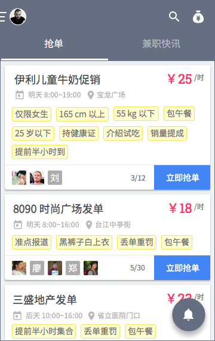
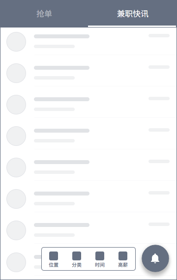

# 兼客首页
## 概览

兼客端首页分为「抢单」「兼职快讯」两个 tab 页。布局及功能与雇主端类似。标题栏左侧可点开「个人中心」，右侧分别为「搜索」「钱袋子」。页面右下方悬浮圆按钮为「消息铃铛」。

--------------------
注：抢单兼职当前仅在福州开通。如 v2.0 App 定位发现用户所处城市未开通抢单兼职，则移除「抢单」「兼职快讯」tab，首页直接显示「兼职快讯」内容。

## 抢单兼职

「抢单」tab 页中，以卡片形式呈现抢单兼职。卡片包含以下信息：

- 标题
- 时薪
- 工作日期及时间段：例如，9/9 至 9/10 8:00~19:00
- 工作地点：详细地址，例如，红坊海峡创意产业园（卡片空间紧凑，不显示区域）
- 备注
- 兼客头像
- 兼客计数

### 标题
小屏幕中标题过长（最多 15 中文字符）则末尾截断，以「…」代替。

### 兼客头像
最新抢单兼客头像在最左侧显示，溢出部分不予以显示。未上传头像的兼客取姓名字符串中一个文字配浅灰色背景。

### 兼客计数
头像列表右侧为已报名兼客数。斜杠后为岗位所需总人数。

> 格式：3 / 12

### 已抢完
名额报满后，抢单卡片不立即消失且在页面中的次序不发生改变。次日零点，方才消失。

## 抢单资格
抢单兼职要求兼客必须认证身份证。兼客点击「立即抢单」后检测用户状态。根据不同用户状态，系统给出不同反馈。

### [双重认证](id:double-check)
由于第二重认证耗时较久，支持第一重认证成功（耗时约几分钟）即可抢单。

- 第一重，所输入身份证号与姓名是否互相匹配。接入政府数据库判断，由[第三方提供服务](http://www.id98.cn/doc/idcard)。
- 第二重，所传照片中身份证号、姓名与所输入的是否一致；手持身份证正面照中，人脸与证件照是否匹配。由客服完成。

#### 认证状态
- 游客：「随便看看」模式下支持不登录进入 App。点击后弹框提示注册或登录。
- 未认证：新用户未认证身份证，点击后弹框提示完善信息。
- 已认证（第一重或第二重）：首次抢单时，最低资格限度为完成第一重身份证认证。点击后弹框再次确认是否抢单。
- 认证失败（第一重或第二重）：弹框提示重新认证。

--------------------
注：首次抢单时，若抢单成功后发生第二重认证失败，不取消该兼客资格。但该兼客在下次抢单时必须成功完成双重认证。

### 保证金
平台规定，每抢一单必须缴纳保证金 30 元。身份证第一重认证成功赠送 30 元红包，仅可被用于缴纳保证金。仅当做满 5 次任意类型兼职后保证金红包可被取出。雇主端操作或逾期平台自动确认「完工」后，立即返还保证金至兼客余额中，否则被判定为放鸽子，保证金不能被返还（扣留在平台中）。

### 日程冲突
- 抢单兼职之间严格控制工作时间不可重叠。点击抢单或报名弹框提示「这个时间段已被预订哦！专心为老板卖力吧~」
- 允许普通兼职与抢单兼职，或普通兼职之间工作时间重叠。
- 同一天最多可报 5 份普通兼职或抢单兼职。点击抢单或报名弹框提示「一天最多参加 5 次兼职哦！别把自己累坏了~」

--------------------
注：验证先后次序为「双重认证 → 保证金 → 日程冲突」。

## 普通兼职

「兼职快讯」 tab 页中呈现普通兼职信息列表。列表项包含以下信息：

- 标题：溢出则截断，以「…」代替
- 薪资
- 工作日期及时间段
- 工作地点：溢出则截断，以「…」代替（列表空间紧凑，不显示区域）
- 岗位图标
- 距离：仅选中「离我最近」筛选项时显示

### 筛选项
筛选功能基本沿用旧版本功能设定，较大变化体现在交互及 UI 上，部分筛选项支持多选。
#### 位置
其中「离我最近」及「全福州」为单选。其他区域为多选。不同城市中，以具体城市名替代福州。单选及多选状态不同时出现。

点击筛选图标展开面板。面板展开后，点击面板外其他区域，或筛选图标这块热区关闭面板同时刷新岗位数据。面板内选项较多时出现滚动条。

- 马尾区
- 晋安区
- 仓山区
- 台江区
- 鼓楼区
- 离我最近
- 全福州

#### 分类
岗位分类支持多选。点击「不限」或「其他」取消所有选择。

- 传单
- 促销
- 礼仪
- 小时工
- …
- 其他
- 不限

#### 时间
单选。沿用旧版本功能设定。

- 长期兼职
- 短期兼职
- 周末兼职
- 明天兼职
- 不限

#### 高薪
单选。选择某单位后，兼职列表仅显示以该单位标明薪资的岗位，且按薪资从高到低排序。

- 标题：按单位从高到低排序
- 元/月
- 元/次
- 元/时
- 元/天
- 不限

### 报名资格
报名普通兼职仅要求兼客必须填写姓名，不作认证。

姓名字段格式要求输入中文或英文，不允许数字或符号出现。最长 15 个字符。

### 选择工作日期
对于一天以上且薪资单位为「元/天」「元/时」的普通兼职，报名时弹框要求兼客选择若干上岗日期。

其他情况下，则弹框再次确认是否报名。
