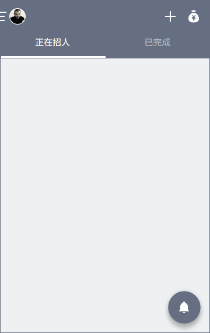
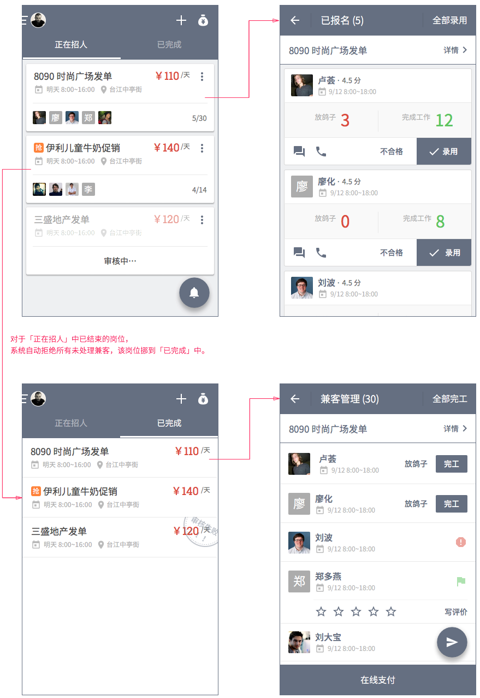

# 雇主首页
## 概览
 雇主端首页分为「正在招人」「已完成」两个 tab 页。标题栏左侧可点开「[个人中心](my-center.html)」，右侧分别为「[新建岗位](new-job.html)」「钱袋子」。页面右下方悬浮圆按钮为「[消息铃铛](notification.html)」。
 


### 招聘主流程


## 正在招人


岗位以卡片形式呈现，以发布时间先后排序，最近发布的岗位在页面最上方。

该 tab 页中岗位状态有 3 类：

- 报名中（普通/抢单）：为最常见状态
- [暂无名额](id:finished)：用背景色强调
- 审核中：作置灰处理


### 可选动作
点击卡片右上角出现下列列表，内含可选动作：

- 刷新岗位：沿用旧版本功能设定
- 结束招聘：点击后弹框

```
结束招聘后岗位将被关闭，但不影响继续录用已报名兼客。
取消 | 确认结束
```

### 标题
区别于普通兼职，抢单兼职标题前有 [抢] 字样。卡片底部为已报名兼客列表，有头像者显示头像，否则以姓氏代之。

### 工作日期及时间段
两类兼职在格式上有细微差别。


#### 抢单兼职
> 格式：明天 8:00~16:30

工作日期为浏览当天日期则为「今天」，次日则为「明天」，第三天则为「后天」。否则，仅显示具体日期。

> 格式：9/1 8:00~16:30

注意剔除月份及日期中多余的零。

#### 普通兼职
> 9/1 至 9/5 8:00~16:30

不做特殊处理。

参见[发布岗位](new-job.html#work-day)表单。

### 工作地点
使用雇主所输入[地址信息](new-job.html#work-place)。
### 结束招聘
岗位招满后自动从「正在招人」移至「已完成」。同时，支持雇主在既定名额未满时手动结束招聘。

### 审核中
审核中的岗位仅雇主可见，不出现在兼客端。点击处在该状态的岗位卡片，直接进入[岗位详情页](job-detail.html#employer)。

## 已报名


点击岗位卡片（除右上角外，整块卡片区域均为热区）进入「已报名」页。

### 数字后缀
页面标题数字后缀为该岗位报名数。
> 格式：已报名 (5)

### 岗位链接
紧邻标题栏为条状岗位链接，点击后跳转至岗位详情页。

不固定浮于顶部，随页面滚动。

### 兼客卡片
兼客信息及可选动作已卡片形式组织。卡片流仅按时间排序。最近报名兼客在最上方。

其中兼客信息包含：

- 头像
- 姓名
- 星级（换算为 5 分平均值，四舍五入取 1 位小数）
- 上岗日期
- 放鸽子次数
- 完成工作次数（雇主手动点击「完工」或逾期系统自动判定）

可选动作包含：

- IM 对聊
- 电话联系
- 不合格
- 录用

兼客报名后即占用该岗位的 1 个名额，仅当雇主点击「不合格」后，该名额被释放。「录用」或「不合格」为一次性操作（不可更改）。不弹框确认（该操作频繁进行，且失误带来损失较轻）。

### 分组规则
按天将报名兼客分组。设今天是 9 月 30 日。

- 今天
- 昨天
- 9 月 28 日
- 9 月 27 日
- ……

### 兼客名片
点击兼客卡片中除下部分可选动作条外的区域，跳转至[兼客名片](my-center.html#about-employee)。

### 全部录用
标题右侧有可选动作「全部录用」，批量录用所有未被处理的兼客。点击后弹框确认。该操作可能耗时较长，使用等待面板「正在处理」减少焦虑。

--------------------
注：录用兼客数达到既定名额时弹框提醒岗位已转移到「已完成」

```
恭喜！岗位已招满。请到【已完成】中管理您录用的兼客。
确定
```

## 已完成


对于「正在招人」中[已结束的岗位](#finished)，如雇主处理完（录用/拒绝）全部已报名兼客，则该岗位自动挪到「已完成」中。

该 tab 页包含以下不同状态的岗位：

- 处理完成：雇主录用了既定名额数量的兼客
- 审核失败
- 被举报：被客服强制关闭，系统立即自动拒绝所有已报名兼客
- 已结束
	- 自动结束：工作结束时间点已过，系统立即自动拒绝所有未录用兼客
	- 手动结束：雇主点击「结束招聘」，系统立即自动拒绝所有未录用兼客


岗位以紧凑的列表形式组织，点击列表项进入该岗位「兼客管理」页。对于审核失败的岗位，点击列表项进入岗位详情页，每次进入页面都弹框显示审核失败原因

```
审核失败原因
[具体文案由客服撰写]
确定
```

页面右下角有浮动圆按钮「编辑」。点击「编辑」跳转至「新建岗位」，注意保留原有岗位字段内容。

--------------------

注：经修改提交的岗位与修改前岗位不存在任何联系。

### 被举报
抢单兼职被举报处理方式，

1.支持雇主继续走完支付流程 
2.系统将全部未处理兼客状态设为「经沟通同意」 
3.消息铃铛通过岗位动态提示兼客
4.待办事项中状态为：岗位下架

## 兼客管理


点击「已完成」中岗位列表项进入「兼客管理」页。
### 岗位链接
（与「已报名」页一致）

### 兼客列表
针对每名兼客有「未到岗」「完工」2 个可选动作。点击「未到岗」后弹框要求选择「经沟通同意」或「放鸽子」。处理完成后按钮组消失，以图标表示处理状态。

另外，被标识为完工的兼客列表项会延伸出星级评价控件。雇主可以只给星级，不写评价。点击「写评价」弹框要求输入评价内容。

#### 兼客名片
点击列表项可进入「兼客名片」。注意，该状态下，兼客名片标题栏应包含可选动作「电话联系」及「IM 对聊」。

#### 评星级控件
星级评价，支持手势拖动更改星级。拖动过程中，右侧出现「4 分」「5 分」等字样。最低 1 分，最高 5 分。一旦释放则评价完成，支持 10 分钟内重新操作以修改星级。

--------------------
注：仅对被处理为「完工」的兼客展开评星级控件。

### 群发消息


点击浮动圆按钮弹框要求选择「消息铃铛群发」「手机短信群发」。

#### 群发即时消息
点击「群发即时消息」进入 App 内群发消息页。标题为兼客姓名集合，溢出部分以「+6」处理，其中数字为被隐藏兼客总和。

发送消息页面与「消息铃铛」内页一致。发送记录同步至「消息铃铛」。同一岗位可多次群发消息。

#### 群发手机短信
沿用旧版本功能设定。

### 全部完工
标题右侧可选动作「全部完工」可对所有未处理兼客进行「完工」处理。对每个兼客只能进行一次处理。该操作可能耗时较长，使用等待面板「正在处理」减少焦虑。

### [在线支付](pay.html)
（点击链接，跳转至相应文档部分）


