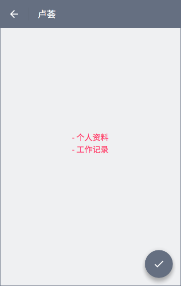

# 雇主首页
## 概览
 雇主端首页分为「正在招人」「已完成」两个 tab 页。标题栏左侧可点开「[个人中心](my-center.html)」，右侧分别为「[新建岗位](new-job.html)」「钱袋子」。页面右下方悬浮圆按钮为「[消息铃铛](notification.html)」。
 

## 正在招人

该 tab 页中包含 2 类岗位：

- 报名中的岗位（普通兼职或抢单兼职）
- 审核中的岗位

岗位以卡片形式呈现。点击卡片右上角出现下列列表，内含可选动作：「结束招聘」。

### 标题
区别于普通兼职，抢单兼职标题前有 [抢] 字样。卡片底部为已报名兼客列表，有头像者显示头像，否则以姓氏代之。

### 工作日期及时间段
两类兼职在格式上有细微差别。
#### 抢单兼职
> 格式：明天 8:00~16:30

工作日期为浏览当天日期则为「今天」，次日则为「明天」，第三天则为「后天」。否则，仅显示具体日期。

> 格式：9/1 8:00~16:30

注意剔除月份及日期中多余的零。

#### 普通兼职
> 9/1 至 9/5 8:00~16:30

不做特殊处理。

参见[发布岗位](new-job.html#work-day)表单。

### 工作地点
使用雇主所输入[地址信息](new-job.html#work-place)。
### 结束招聘
岗位招满后自动从「正在招人」移至「已完成」。同时，支持雇主在既定名额未满时手动结束招聘。

### 审核中
审核中的岗位仅雇主可见，不出现在兼客端。

## 已报名

点击岗位卡片（除右上角外，整块卡片区域均为热区）进入「已报名」页。

### 数字后缀
页面标题数字后缀为该岗位报名数。
> 格式：已报名 (5)

### 岗位链接
紧邻标题栏为条状岗位链接，点击后跳转至岗位详情页。

不固定浮于顶部，随页面滚动。

### 兼客卡片
兼客信息及可选动作已卡片形式组织。卡片流仅按时间排序。最近报名兼客在最上方。

其中兼客信息包含：

- 头像
- 姓名
- 星级（换算为 5 分平均值，带 1 位小数）
- 上岗日期
- 放鸽子次数
- 完成工作次数（雇主手动点击「完工」或逾期系统自动判定）

可选动作包含：

- 拨打兼客电话
- 不合格
- 录用

兼客报名后即占用该岗位的 1 个名额，仅当雇主点击「不合格」后，该名额被释放。

### 兼客详情

点击兼客卡片中除下部分可选动作条外的区域，进入兼客详情页。

以兼客姓名作为详情页标题。

兼客详细信息分为个人资料及工作经历 2 部分。

**个人资料**包含：

- 头像
- 放鸽子次数
- 完成工作次数
- 姓名
- 身份证号
- 常在地
- 学校
- 性别
- 身高
- 体重

极端情况下，兼客个人资料仅「姓名」一项，放鸽子及完成工作经历均为 0。新用户报名普通兼职是要求兼客输入个人资料，仅「姓名」为必填项。抢单兼职中有姓名、身份证号（已认证）。

如学校、性别等字段，若内容为空，则不在页面中显示。

**工作记录**包含完工记录，以时间轴形式组织。

### 全部录用
标题右侧有可选动作「全部录用」，点击后批量录用所有报名兼客。

## 已完成

该 tab 页包含以下不同状态的岗位：

- 已报满的岗位（抢单或普通）
- 手动结束报名的岗位（抢单或普通）
- 审核失败的岗位

岗位以紧凑的列表形式组织，点击列表项进入该岗位「兼客管理」页。

 对于审核失败的岗位，点击列表项进入岗位详情页，页面内容包含：
 
 - 审核失败原因（文案由客服撰写或选择模板）
 - 浮动圆按钮「编辑」
 
 点击「编辑」修改岗位信息后可通过「确认发布」再次提交。

--------------------

注：经修改提交的岗位与修改前岗位不存在任何联系，支持编辑审核失败岗位的原因在于避免令雇主重复输入信息。

## 兼客管理

点击「已完成」中岗位列表项进入「兼客管理」页。
### 岗位链接
（与「已报名」页一致）

### 兼客列表
针对每名兼客有「放鸽子」「完工」2 个可选动作。点击后按钮组消失，以图标表示处理状态。

另外，被标识为完工的兼客列表项会延伸出星级评价控件。雇主可以只给星级，不写评价。点击「写评价」跳转至评价页。

### 群发消息

点击浮动圆按钮，进入群发消息页。标题为兼客姓名集合，溢出部分以「+6」处理，其中数字为被隐藏兼客总和。

发送消息页面与「消息铃铛」内页一致。发送记录同步至「消息铃铛」。同一岗位可多次群发消息。

### 全部完工
标题右侧可选动作「全部完工」可对所有未处理兼客进行「完工」处理。对每个兼客只能进行一次「完工」或「放鸽子」处理。

### [在线支付](pay.html)
（点击链接，跳转至相应文档部分）

## [岗位详情](id:job-detail)
与兼客端所见[岗位详情](home-employee.html#job-detail)仅几处区别：

### 标题栏
从右至左，标题栏可选动作分别为：

- 下拉列表
	- 结束招聘
	- 刷新置顶
- 社交分享

### 移除模块
- 圆形浮动按钮
- 报名按钮
- 已报名兼客
- 评论区脚注

### 雇主答疑
移除「提问题」链接，每条兼客评论下有「回复」链接。一条评论只能被回复一次，兼客提问题，雇主答疑，兼客提另一个问题，雇主再次答疑。兼客之间不能互相评论。

## 重新发布
特别地，「已完成」tab 中审核失败的岗位，点击后直接进入岗位详情页，与已上架的岗位详情页相比，标题栏仅一个可选动作：编辑。点击「编辑」进入相应的「发布岗位」页，注意表单字段内容不丢失。
