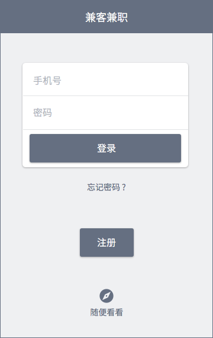
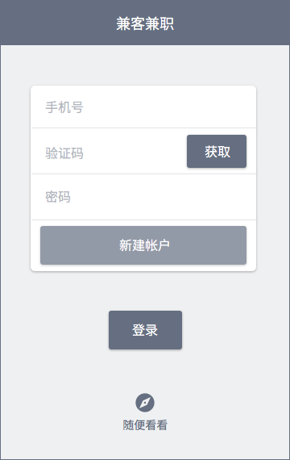

# 启动模块
## 启动画面
（UI 暂缺）

用于缓解启动 App 时的等待焦虑。
## 引导页
（UI 暂缺）

安装 App 后首次打开，进入长达 3~4 屏的引导页。

--------------------
注：首次打开 App 不出现启动画面。
## 登录注册
登录及注册模块在同一页面中，点击「注册」呼出注册相关组件，隐藏登录相关组件，反之亦然。




与旧版本有较大区别，2.0 版本中注册时不区分用户角色为兼客或雇主（App 内可自由切换）。首次注册成功后，统一直接进入「兼客首页」。

针对目的明确的，需要发布岗位的用户，结合操作上下文引导其切换为雇主模式。

### 兼容旧版本
新旧版本账号体系冲突，处理方式如下：

1. 手机号一样，两个密码：
更新至 2.0 后首次登录，进入该密码所对应端。登录成功同时合并两端数据，移除另一登录密码。该操作需要以短信通知用户。

2. 手机号一样，密码也一样：
更新至 2.0 后首次登录，统一进入雇主端。

3. 修改密码/手机号必须升级至 2.0：
修改后两套帐户统一密码/手机号


## 随便看看
支持未登录用户，即游客进入兼客首页，支持其作为兼客浏览抢单/兼职岗位，打开左侧抽屉中各列表项，查看钱袋子及消息铃铛。游客甚至可以切换为雇主模式。

鼓励游客查看、浏览性质的操作，涉及输入信息、发布岗位、抢单/报名、发消息、取出/充值等操作均弹框提示「怎么样，第一印象不错吧！这货挺靠谱的，大家一块儿用起来~」「取消」「注册」。

## 首次登录
登录并选择城市后，统一进入兼客首页，此时即刻弹框提示：

```
您要找兼职？
点击确定继续浏览。发岗位招人请切换为雇主。
切换为雇主 | 确定
```