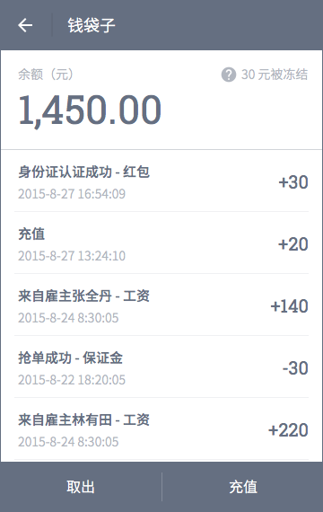
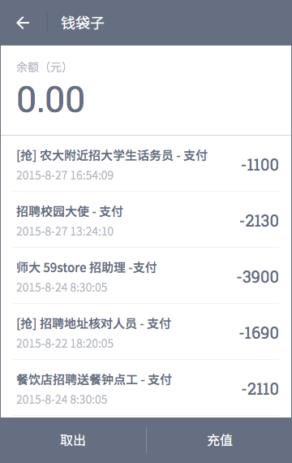
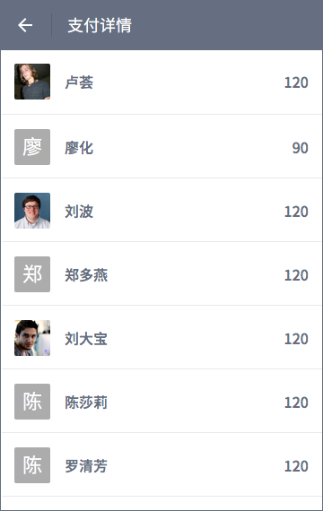

# 钱袋子
## 概览
兼客与雇主的「钱袋子」页面布局一致，都支持「取出」「充值」。仅流水记录类型存在差别。「钱袋子」为用户钱包，无需绑定任何支付方式也能用钱包收钱（这一点可类比微信钱包）。在涉及支付，余额不足，或需要取出余额时才需要作绑定。
### 兼客端

### 雇主端

### 余额
> 余额（元）1,890.00

格式：整数部分每 3 位以英文逗号隔开。保留 2 位小数点。

### 流水记录
#### 兼客
- 抢单成功 - 保证金
- 恭喜完工大吉 - 返还保证金
- 来自雇主张全丹 - 工资
- 充值
- 取出

#### 雇主
- [岗位名] - 支付
- [抢] [岗位名] - 支付
- 充值
- 取出

支付抢单兼职所生产流水记录以 [抢] 标识。

特殊地，雇主付工资产生的流水记录含二级页面，点击后进入「支付详情」页，详细说明该笔交易所涉及兼客及金额。

	
注：名称可重复。即，雇主可能在同一个岗位的支付页中多次支付。

### 时间戳
> 2015-8-27 16:54:09

格式：[年-月-日] + [24 小时制精确到秒]，二者以空格隔开。

每项流水记录应有详细时间戳。

### 取出
通过「取出」将钱袋子中的余额转入微信钱包。点击后弹框，要求输入金额。

### 充值
通过「充值」将微信钱包中的金额转入钱袋子。点击后弹框，要求输入金额。点击弹框中的「确定」后将账单提交至微信。