# 个人中心
## 抽屉列表
### 兼客端
- 头像及姓名
- 次完工 | 次放鸽子：仅作为信息展示，不可点击
- 切换城市：沿用旧版本功能设定
- 待办事项
- 兼客名片
- 工作经历
- 吐槽冲我来
- 切换为雇主
- 设置

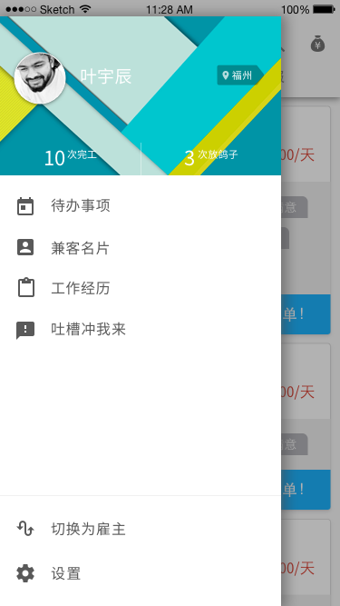

### 雇主端
- 头像及姓名；次岗位 | 次投诉；切换城市
- 雇主信息
- 吐槽冲我来
- 切换为兼客
- 设置

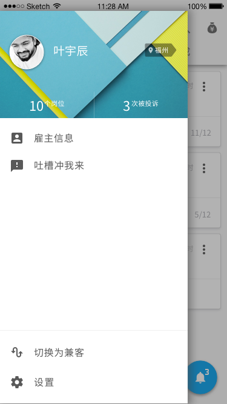
## 兼客端
### 待办事项
与 v1.15 相比，有细微改变：

- 联系方式
	- IM 对聊：如雇主未开通 IM 则置灰，不可点击
	- 电话联系
- 融合抢单兼职：处理流程更简短

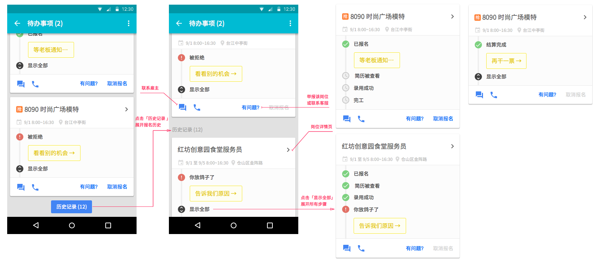

#### 所有处理节点
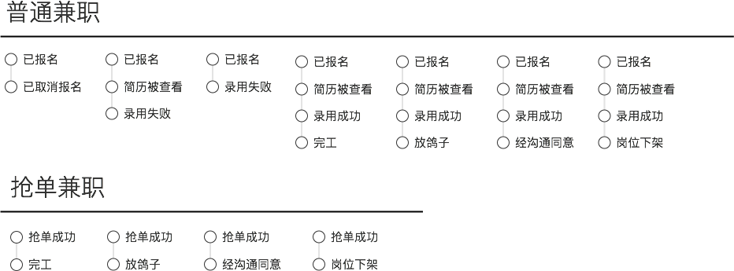

### 工作经历
以时间线将放鸽子及完工经历组织起来。仅兼客自己可见，暂不对其他兼客或雇主开放。

### [兼客名片](id:about-employee)
- 头像
- 星级：对平均值作四舍五入，取 1 位小数
- 次放鸽子 | 次完工：仅作为信息展示，不可点击
- 姓名
- 身份证：认证一旦成功完成，不允许修改。 1 个身份证绑定 1 个手机号。
- 常在地
- 学校；性别；身高；体重

#### 查看
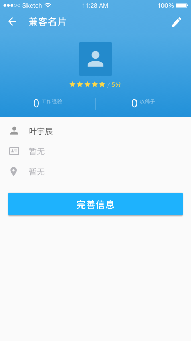
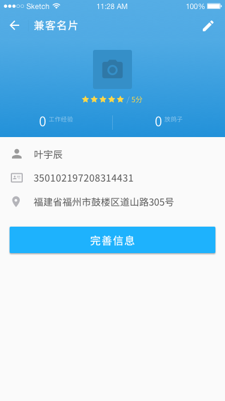
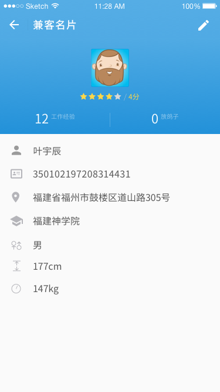

极端情况下，兼客个人资料仅「姓名」一项，放鸽子及完成工作经历均为 0。新用户报名普通兼职是要求兼客输入个人资料，仅「姓名」为必填项。抢单兼职中有姓名、身份证号（实名认证）。

如学校、性别等字段，若内容为空，则不在页面中显示。

--------------------
注：

1. 「认证中…」状态不可点击
2. 点击姓名旁的「实名认证」后弹框显示具体内容

#### 编辑
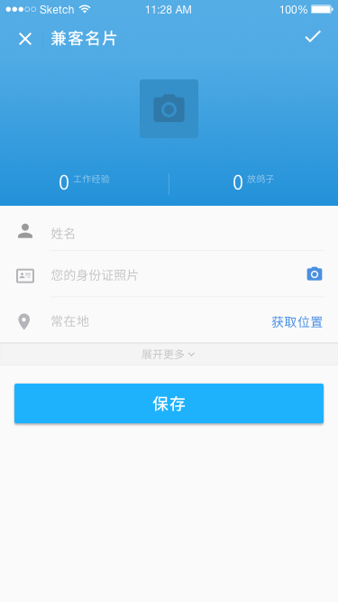
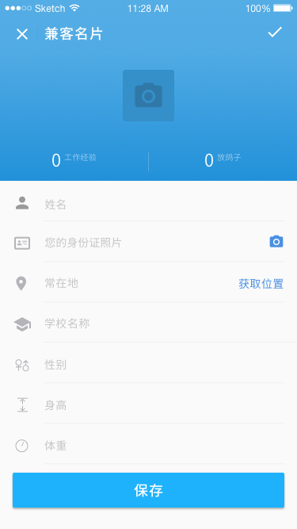

#### 雇主查看
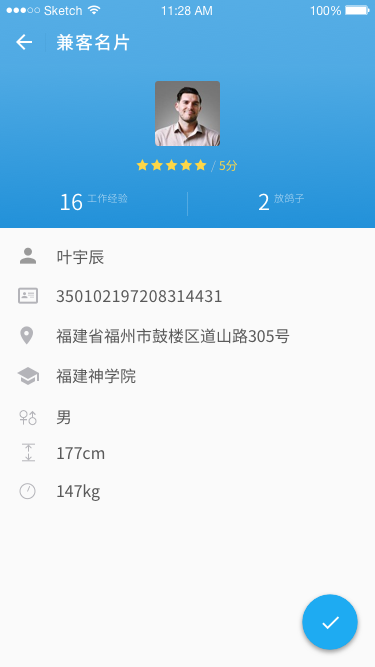
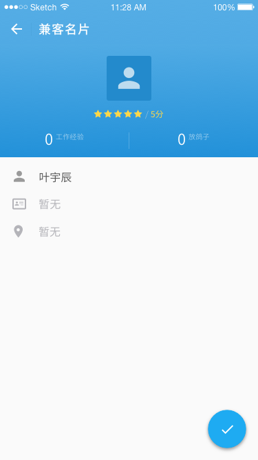

## 雇主端
### [雇主信息](id:about-employer)
- 头像
- 次岗位 | 次投诉：仅作为信息展示，不可点击
- 姓名
- 身份证：认证一旦成功完成，不允许修改。 1 个身份证绑定 1 个手机号。
- 公司名：
- 营业执照号：

#### 查看
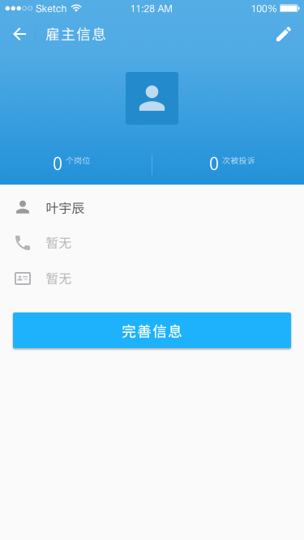
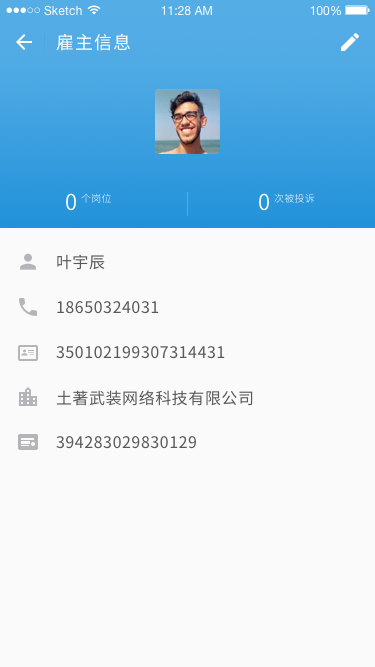

--------------------
注：

1. 企业认证同样有「认证中…」状态，不可点击
2. 企业认证通过后获得「企业认证」标识
3. 点击「企业认证」标识弹框显示具体内容

#### 编辑
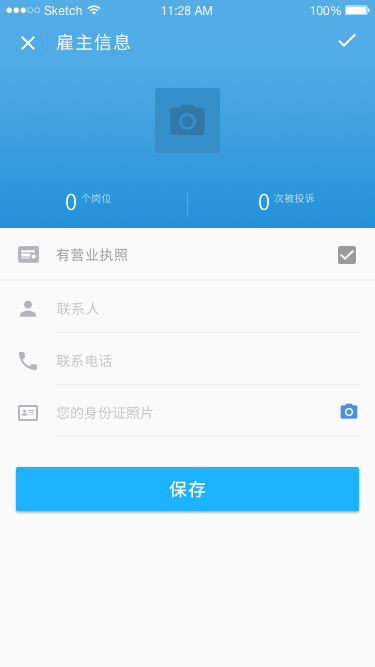
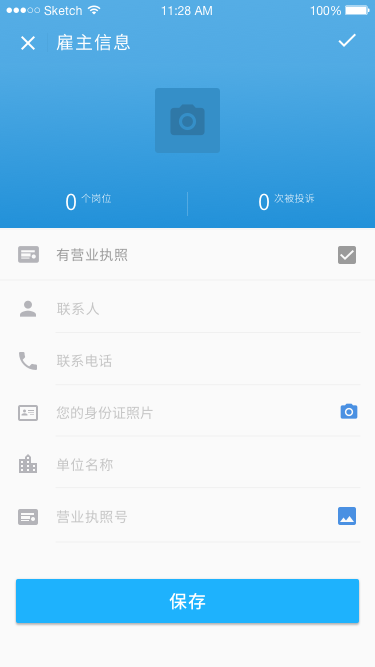

#### 兼客查看

## 公用模块
### 选择城市
用户打开 App 时，系统检测用户所在城市。若自动定位有误，则用户可在「个人中心」中找到选择城市的入口。

### 切换身份
所有用户仅需注册 1 枚帐号。登录 App 后可随时切换身份，既可以作为兼客打工赚钱也可以作为雇主花钱请人。

1. 为防止用户独自刷单，不允许用户对自己所发岗位报名/抢单。
2. 钱袋子余额及流水记录通用于 2 个身份，即切换前后钱袋子页面并无变化。
3. 身份证认证成功后通用于 2 个身份。
4. 其他信息或功能并行 2 套，不互通。

### 吐槽冲我来
- 不会用
- 对话产品汪

「不会用」中嵌入网页。其余 3 项点击后进入 IM 对聊，此聊天页面及消息提醒不出现在消息铃铛中。
#### 不会用
（内容暂缺）
一级页面为热门问题列表，二级页面为针对该问题的分布操作引导。

#### 对话产品汪
文本框及提交按钮。下方为二维码及 QQ 群号，引导用户加群。

>Q群：257635943

> ☝(•̀˓◞•́)
此处对话产品汪
多喷口水少扔砖
~

### 设置
- 账号信息
    - 手机号
    - 密码
    - ~~绑定微信~~ 当前版本暂且隐藏
- 使用引导：（内容暂缺）
- 赏个好评：沿用旧版本功能设定
- 检查更新：沿用旧版本功能设定
- 关于兼客：（内容暂缺）
- 退出登录：点击后退出登录成为游客，切换至「随便看看」模式。