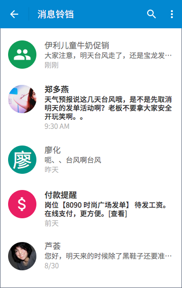
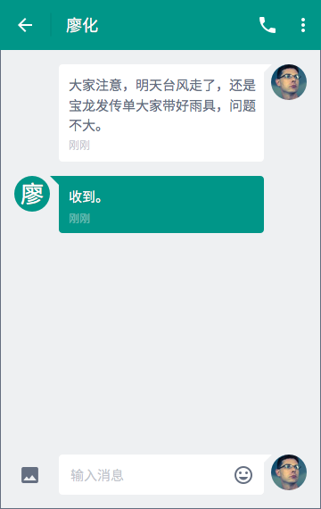
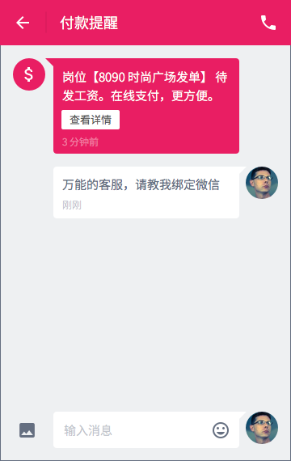

# 消息铃铛

## 消息列表
### 概览

每个列表项是独立的联系人，排序方式采用有新消息送达则置顶的规则。（可类比微信）

- 头像
- 标题
- 缩略内容
- 接受/发送时间

### 头像
共 4 类头像：

- 系统生成头像：汉字 + 纯色背景
- 用户上传头像：图片
- 群发消息：图标 + 纯色背景
- 系统消息：图标 + 纯色背景
	- 付款提醒	
	- 岗位动态
	- 平台推送

### 未读消息
缩略内容最多可显示 3 行。

### 已读消息
标题及缩略内容变灰，且缩略内容仅显示 1 行。

## 消息内容
### 雇主回复兼客
标题栏右侧可选动作：

- 电话联系
- 下拉列表
	- [兼客名片](my-center.html#about-employee)
	- 不再提醒/开启提醒：接收消息，但不提醒。仍在消息列表中出现。

### 兼客回复雇主
标题栏右侧可选动作：

- [雇主信息](my-center.html#about-employer)
- 下拉列表
	- 不再提醒/开启提醒

--------------------
注：

1. 不在该页面提供「电话联系」入口。联系人及联系电话与岗位一一对应，兼客需要在岗位详情页或待办事项中找到联系电话。
2. 标题栏文字为雇主姓名（而非联系人）。

### 雇主群发消息
标题栏文字为岗位标题。

### 系统消息
标题栏右侧：联系客服。

「付款提醒」「到账提醒」「岗位动态」「平台推送」4 类消息统称为系统消息。可类比微信服务号。

大部分系统消息中含「查看详情」按钮，点击后跳转至相关页面。

支持用户直接在文本框中询问客服。

## 所有类型
所有消息类型可按流向划分为 4 类：

- 雇主 → 兼客
- 兼客 → 雇主
- 平台 → 兼客
- 平台 → 雇主

### 雇主 → 兼客
- 评论得到雇主回复，跳转至岗位详情：您收到了一条雇主回复：[回复内容]「查看详情」
- 系统以雇主的身份代发，内容显示在一对一聊天页中
	- 普通兼职
	     - 报名成功：“欢迎报名，有啥不清楚的尽管问哦~”
	- 抢单兼职
	     - 抢单成功：“抢单成功！好一个眼疾手快~”
- 一对一聊天
- 收到来自雇主的群发消息

--------------------
注：由系统代发的消息不在雇主端作新消息提醒，即雇主的「消息铃铛」页中不出现与相关兼客的聊天记录，除非兼客对该消息进行回复。此时，雇主可对新消息进行回复，系统代发消息也出现在各自聊天记录中。

### 兼客 → 雇主
- 兼客评论，通过「岗位动态」将评论内容发送至雇主：您收到一条问题：【[评论内容]】，快去解答吧~「查看详情」
- 一对一聊天

### 平台 → 兼客
- 平台推送
	- 推送兼职：文字内容后有「查看详情」按钮，点击后跳转至岗位详情页。
	- 推送资讯：类似旧版本中的「兼客乌托邦」，仅支持文字。带「查看详情」按钮，点击后跳转至文章/活动内容页。
- 钱袋子：
	- 到账提醒：收到工资 ￥[总额]，来自[雇主姓名]发布的【[岗位标题]】「查看详情」
	- 充值成功，跳转至「钱袋子」：充值成功！￥[金额]元已收进钱袋子「查看详情」
	- 取出成功，跳转至「钱袋子」：￥[金额]元已成功转入微信钱包！「查看详情」
- 岗位动态
	- 录用失败：对不起，您报名的【[岗位标题]】没有得到录用。看看其他合适的岗位吧~
	- 录用成功：恭喜！您被雇主录用了。岗位：【[岗位标题]】
	- 报名的岗位被下架：对不起，您报名的【[岗位标题]】被请去喝茶了。看看其他合适的岗位吧~
	- 提醒明天上岗（一个岗位仅提醒一次）： 您报名的【[岗位标题]】明天要上岗啦！~「查看详情」
	- 雇主操作「放鸽子」：放鸽子 +1，来自[雇主姓名]发布的【[岗位标题]】。有问题可以找客服帮忙哦~
	- 雇主操作「经沟通同意」：经沟通同意无法到岗，来自[雇主姓名]发布的【[岗位标题]】。有问题可以找客服帮忙哦~
	- 雇主评星级，「查看详情」跳转至工作经历（仅对星级作提醒，写评价暂不提醒）：您获得了 [星级数] 星评价，来自[雇主姓名]发布的【[岗位标题]】
- 帐户信息
	- 手机号修改成功：恭喜！您刚刚成功修改了手机号。
	- 密码修改成功：恭喜！您刚刚成功修改了登录密码。
	- 身份证认证成功：恭喜！您提交的身份证信息已通过审核。
	- 身份证认证失败：对不起！您提交的身份证信息无法通过审核，您可以更正信息后重新认证。「查看详情」
- 客服美少女

#### 找客服
用于反馈无特定主题的问题，由客服处理。

首次进入时，页面中停留 3 s 后，系统代发消息：

> 宝贝儿~ 有什么可以帮您的

注意，聊天页标题栏移除「电话联系」入口。

### 平台 → 雇主
- 岗位动态
	- 审核成功：恭喜！您发布的【[岗位标题]】已通过审核，一大波兼客准备报名
	- 审核失败：对不起！您发布的【[岗位标题]】无法通过审核。有问题可以找客服帮忙哦~
	- 被兼客投诉，显示投诉内容：您发布的【[岗位标题]】收到一条投诉：[投诉内容]
	- 获得首个报名/抢单：有人报名啦！岗位：【[岗位标题]】「查看详情」
	- 岗位已报满，跳转至「已报名」：人都来齐了，快去录用吧！岗位：【[岗位标题]】「查看详情」
	- 岗位已抢完，跳转至「兼客管理」：名额已抢完，看看都有些谁~ 岗位：【[岗位标题]】「查看详情」
- 钱袋子：
	- 付款提醒，跳转至「在线支付」：您的岗位【[岗位标题]】该发工资啦！在线支付更便捷「查看详情」
	- 付款成功，跳转至「钱袋子」：成功支付工资 ￥[总额]。岗位：【[岗位标题]】「查看详情」
	- 充值成功，跳转至「钱袋子」：充值成功！￥[金额]元已收进钱袋子「查看详情」
	- 取出成功，跳转至「钱袋子」：￥[金额]元已成功转入微信钱包！「查看详情」
- 平台推送
	- 推送资讯
- 帐户信息
	- 手机号修改成功
	- 密码修改成功
	- 身份证认证成功
	- 营业执照认证成功：恭喜！您已成功认证营业执照并获得了【企业认证】标识。
	- 营业执照认证失败：对不起！营业执照认证失败。请更正后再试一次「查看详情」
- 客服美少女

--------------------

注： 当前版本暂时隐藏旧版本中「加好友」「雇主号」。「功能号」中仅保留「兼客乌托邦」向兼客推送资讯。

## 通知栏
- 前台运行：不发送通知栏消息
- 后台运行：发送通知栏消息，层叠显示，不覆盖
- 后台关闭：无法发送通知栏消息（技术实现原因）

App 后台运行时，消息铃铛中新产生的消息会在通知栏中推送，点击通知栏单条消息进入消息内容页（而非消息列表）。特殊地，该条消息中含类似「查看详情」按钮时，点击后直接进入按钮指向页面。

