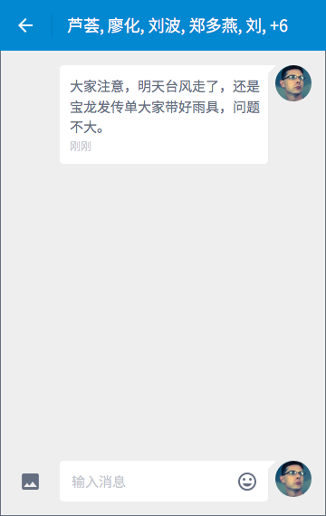

# 消息铃铛

## 消息列表
### 概览

每个列表项是独立的联系人，排序方式采用有新消息送达则置顶的规则。（可类比微信）

- 头像
- 标题
- 缩略内容
- 接受/发送时间

### 头像
共 4 类头像：

- 系统生成头像：汉字 + 纯色背景
- 用户上传头像：图片
- 群发消息：图标 + 纯色背景
- 系统消息：图标 + 纯色背景
	- 付款提醒	
	- 岗位动态
	- 平台推送

### 未读消息
缩略内容最多可显示 3 行。

### 已读消息
标题及缩略内容变灰，且缩略内容仅显示 1 行。

## 消息内容
### 雇主回复兼客
标题栏右侧可选动作：

- 电话联系
- 下拉列表
	- [兼客名片](my-center.html#about-employee)
	- 不再提醒/开启提醒：接收消息，但不提醒。仍在消息列表中出现。

### 兼客回复雇主
标题栏右侧可选动作：

- 电话联系
- 下拉列表
	- [雇主信息](my-center.html#about-employer)
	- 不再提醒/开启提醒

### 雇主群发消息
标题栏文字为兼客列表，以「, 」隔开，溢出部分以「+6」代替，具体数字依据溢出兼客总数而定。

### 系统消息
标题栏右侧：联系客服。

「付款提醒」「到账提醒」「岗位动态」「平台推送」4 类消息统称为系统消息。可类比微信服务号。

大部分系统消息中含「查看详情」按钮，点击后跳转至相关页面。

支持用户直接在文本框中询问客服。

## 所有类型
所有消息类型可按流向划分为 4 类：

- 雇主 → 兼客
- 兼客 → 雇主
- 平台 → 兼客
- 平台 → 雇主

### 雇主 → 兼客
- 评论得到雇主回复
- 系统以雇主的身份代发，内容显示在一对一聊天页中
	- 普通兼职
	     - 报名成功：“欢迎报名，有啥不清楚的尽管问哦~”
	     - 录用成功，“我给你点录用了，到时候记得腾出时间来干活~”
	     - 录用失败，“不好意思，这次你可能不太合适。”
	- 抢单兼职
	     - 抢单成功：“抢单成功！好一个眼疾手快~”
- 一对一聊天
- 群发消息

--------------------
注：由系统代发的消息不在雇主端作新消息提醒，即雇主的「消息铃铛」页中不出现与相关兼客的聊天记录，除非兼客对该消息进行回复。此时，雇主可对新消息进行回复，系统代发消息也出现在各自聊天记录中。

### 兼客 → 雇主
- 兼客评论，通过「岗位动态」将评论内容发送至雇主
- 一对一聊天

### 平台 → 兼客
- 平台推送
	- 推送兼职
	- 推送资讯：类似旧版本中的「兼客乌托邦」
- 到账提醒
- 岗位动态
     - 报名岗位被举报下架
     - 提醒明天上岗
     - 雇主操作「放鸽子」
- 账户信息
	- 手机号修改成功
	- 密码修改成功
	- 身份证认证成功/失败

### 平台 → 雇主
- 岗位动态
	- 审核结果，成功/失败
	- 被兼客投诉，显示投诉内容
	- 获得首个报名/抢单
	- 岗位已报满/抢完
- 付款提醒
- 平台推送
	- 推送资讯
- 账户信息
	- 手机号修改成功
	- 密码修改成功
	- 身份证认证成功/失败
	- 营业执照认证成功/失败

--------------------

注：

1. 因「提取」「充值」使钱袋子余额发送变化不在消息铃铛中提醒。
2. 当前版本暂时隐藏旧版本中「加好友」「雇主号」。「功能号」中仅保留「兼客乌托邦」向兼客推送资讯。

## 手机短信
对于采集岗位，雇主一般未安装 App，无法通过消息铃铛接收提醒。另外，一些涉及到金额变化的重要操作也需要通过手机短信作提醒。

1. 岗位被客服采集 (旧版本已实现)
2. 采集平台创建雇主账号  (旧版本已实现)
3. 采集岗位有兼客投递  (旧版本已实现)
4. 雇主6个小时未处理简历短信提醒 (旧版本已实现)
5. 兼客放鸽子被扣保证金 
6. 雇主发放工资 - 扣款提醒
7. 雇主提现成功
8. 雇主充值成功
8. 兼客提现成功 
9. 兼客收到工资
10. 兼客充值成功

